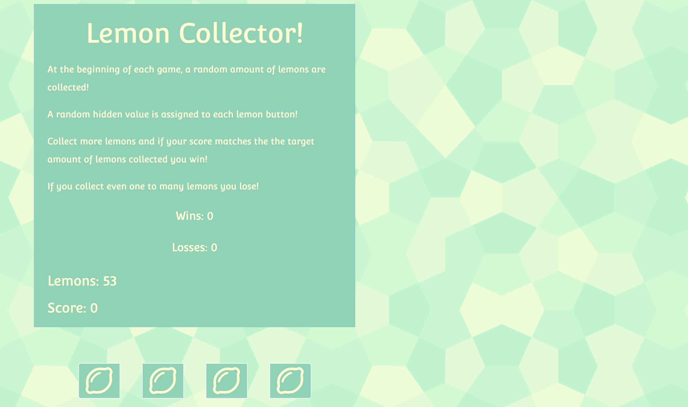

# NumberGenerator

* This game is the classic javascript crystal game with a slight twist! 

* This game showcases my ability to use javascript as well as JQuery. 

* The game works by an initiation function being called that generates a random target score between 20 and 120, setting your score to zero, and a random value being assigned to each button. 

* As you click each button a score is totaled, and if your score equals the target number you win! 

**After each win and loss, the initiation function is recalled and the game starts over! 

**Check out the game here: https://cmader555.github.io/NumberGenerator/ 

## Installation 

* If you would like you can clone or download this code to your local machine

## Preview 

